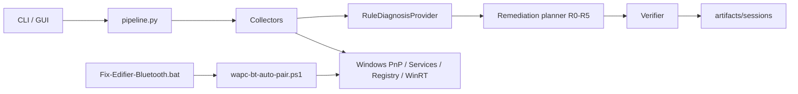

# Windows Audio Path Checker

Evidence-driven diagnostics for Windows playback problems — especially Bluetooth
headsets that show **Connected** but produce **no audio**.

> **Core principle:** `Bluetooth Connected ≠ Audio Working.`

The Windows sound test can succeed while apps are silent (per-app mute/routing),
or Windows can show a headset as Connected while the A2DP → MEDIA → AudioEndpoint
path never finished enumerating. This tool models that full path and tells you
**which transition failed**.

## Motivating failure (EDIFIER W800BT Pro)

```text
EDIFIER connected
+
no AudioEndpoint
+
WinRT discovery unavailable (or auto-pair spam-looping on DeviceInformation)
```

A recovery script that only resets Bluetooth cannot verify recovery. The upgraded
system:

1. Collects structured evidence (adapter, pair/connect, A2DP/MEDIA, endpoints, services)
2. Classifies an explicit state (e.g. `MEDIA_NO_ENDPOINT`)
3. Checks invariants (`connected ⇒ endpoint should exist`)
4. Ranks hypotheses (`audio_endpoint_enumeration_failure`, …)
5. Recommends the **lowest-risk** action (R0–R5)
6. Verifies whether the **system** recovered — not merely whether a command exited 0

WinRT auto-pair is gated by a **one-shot capability probe**. If
`Windows.Devices.Enumeration.DeviceInformation` cannot be projected in Windows
PowerShell 5.1, discovery is skipped with a single structured failure — no
90-second error spam.

**Encoding pitfall (fixed):** Windows PowerShell 5.1 loading UTF-8 *without BOM*
can mis-parse Unicode punctuation (for example an em-dash `—` inside a
double-quoted string). That made an `else` branch string absorb the rest of
`wapc-bt-auto-pair.ps1`, so after `=== DISCOVERY CAPABILITY CHECK ===` the
script skipped AUTO-PAIR and jumped to `DONE`. Repair scripts are now
ASCII-only and report `FINAL RESULT` (`SUCCESS` / `REPAIR_INCOMPLETE` / …)
instead of a naked `DONE`.

**Auto-pair upgrade (v0.5+):** `Fix-Edifier-Bluetooth.bat` runs
`scripts/wapc-bt-auto-pair.ps1`, which preserves the cleanup pipeline then
delegates discovery/pairing to modular WinRT stages:

```text
BluetoothDiscovery.psm1       multi-selector + AssociationEndpoint enum
BluetoothCandidateRanker.psm1 Python ranker (single source of truth)
BluetoothPairingEngine.psm1   state machine, history, PairAsync gating
BluetoothPairingVerifier.psm1 post-pair PnP / A2DP / AudioEndpoint wait
```

The engine never calls `PairAsync()` when `CanPair=False` and `IsPaired=False`.
It ranks all EDIFIER endpoints (Classic vs BLE vs audio service), logs candidate
metadata, and returns `DISCOVERABLE_NOT_PAIRABLE` when no pairable Classic
association endpoint appears. Diagnostics JSON:
`%TEMP%\wapc-bt-pair-diagnostics.json`.

```powershell
# Run as Administrator (hold headset in pairing mode when prompted)
.\Fix-Edifier-Bluetooth.bat
.\Fix-Edifier-Bluetooth.bat -Diagnostics -VerboseLog
.\Fix-Edifier-Bluetooth.bat -WhatIf   # dry-run destructive cleanup only
```

After repair, verify with:

```powershell
python -m audio_path_checker --diagnose --device "EDIFIER W800BT Pro"
```


Requirements: Windows 10/11 and Python 3.10+.

```powershell
py -m venv .venv
.\.venv\Scripts\python -m pip install -e .
.\.venv\Scripts\python -m audio_path_checker --diagnose --device "EDIFIER W800BT Pro"
.\.venv\Scripts\python -m audio_path_checker --diagnose --json
```

GUI / classic session scan:

```powershell
.\run_checker.bat
# or
.\.venv\Scripts\python -m audio_path_checker
```

## CLI safety modes

| Flag | Behavior |
|---|---|
| `--diagnose` / `--dry-run` | Evidence + diagnosis + plan only (default safe path) |
| `--repair` | Allow up to **R3** (refresh / scoped re-enumerate) |
| `--aggressive-repair` | Allow up to **R5** (scoped pairing-cache clear) |
| `--json` | Machine-readable pipeline output |
| `--device NAME` | Scope headset matching (default EDIFIER W800BT Pro) |
| `--no-artifacts` | Skip writing `artifacts/sessions/…` |

`PAIRED_NOT_CONNECTED` with no A2DP, MEDIA, or AudioEndpoint nodes is treated
as a genuinely offline headset: power on/connect the device and recheck before
any endpoint repair. The R1 refresh is reserved for a connected headset with a
missing audio stack, or for contradictory connection and endpoint evidence. It
only re-queries the `MEDIA` and `AudioEndpoint` inventories; it does not restart
services, scan all PnP devices, toggle the adapter, or remove pairing.

Legacy opt-in repairs remain available:

```powershell
.\.venv\Scripts\python -m audio_path_checker --unmute-browsers
.\.venv\Scripts\python -m audio_path_checker --enable-bluetooth-adapter
.\.venv\Scripts\python -m audio_path_checker --add-bluetooth
.\.venv\Scripts\python -m audio_path_checker --add-bluetooth "EDIFIER W800BT Pro" --bluetooth-address c8247887e57c
.\.venv\Scripts\python -m audio_path_checker --repair-bluetooth "EDIFIER W800BT Pro"
```

**Add Bluetooth device:** GUI button **Add Bluetooth device** or CLI `--add-bluetooth` launches the elevated identity-safe auto-pair script (`scripts/wapc-bt-auto-pair.ps1`). Put the headset in pairing mode (LED flashing) first. Default target is EDIFIER W800BT Pro (`c8247887e57c`).

## Architecture

Two runtime stacks:

1. **Python diagnostic pipeline** — observe → classify → plan → verify → session artifacts  
2. **Elevated PowerShell Bluetooth recovery** — cleanup → adapter/services → WinRT pair → audio verification  



```text
Observe → Collect → Normalize → Diagnose → Decide → Remediate → Verify → Audit
```

Read path (`--diagnose` / `--dry-run`) does not mutate the system. Write path
(`Fix-Edifier-Bluetooth.bat`, legacy repair flags) requires Administrator for
registry/PnP/service changes.

Full diagrams (pipeline, pairing state machine, trust boundaries, sequence,
component table, failure taxonomy, gap analysis):
[docs/architecture.md](docs/architecture.md).

LLM agents (future) may **propose** actions only. They must never execute
PowerShell directly:

```text
LLM proposes → Policy validates → Executor executes → Verifier confirms
```

### Python modules

| Area | Location |
|---|---|
| WinRT capability | `audio_path_checker/platform/winrt.py` + `scripts/Platform/WinRT.ps1` |
| Evidence | `audio_path_checker/collectors/evidence.py` + `scripts/Collectors/Evidence.ps1` |
| States | `audio_path_checker/models/states.py` |
| Classifier / invariants / root cause | `audio_path_checker/diagnostics_engine/` |
| Planner / verification | `audio_path_checker/remediation/` |
| Pipeline + CLI report | `audio_path_checker/pipeline.py` |
| Session trail | `audio_path_checker/session/artifacts.py` |
| Evaluation scaffold | `audio_path_checker/evaluation/harness.py` |
| Bluetooth pairing ranker | `audio_path_checker/bluetooth_pairing/` + `scripts/Bluetooth/*.psm1` |
| Classic app-session scan | `audio_path_checker/diagnostics.py` (preserved) |

## Evidence model

Evidence is normalized JSON, for example:

```json
{
  "device": { "name": "EDIFIER W800BT Pro", "paired": true, "connected": true },
  "bluetooth": { "adapter_present": true, "adapter_status": "OK" },
  "audio": {
    "media_node_present": true,
    "endpoint_present": false,
    "endpoint_active": false
  },
  "services": { "bthserv": "Running", "Audiosrv": "Running" }
}
```

## State machine

```text
UNKNOWN
RADIO_UNAVAILABLE
DEVICE_NOT_PAIRED
PAIRED_NOT_CONNECTED
CONNECTED_NO_A2DP
A2DP_NO_MEDIA_NODE
MEDIA_NO_ENDPOINT
ENDPOINT_DISABLED
ENDPOINT_NOT_DEFAULT
AUDIO_SERVICE_FAILURE
AUDIO_PATH_HEALTHY
```

Path model:

```text
Physical device → Radio → Paired → Connected → A2DP → MEDIA
  → AudioEndpoint → Active → Default route → Audio engine → App session → Sound
```

## Remediation risk model

| Risk | Meaning |
|---|---|
| R0 | Observation / open Settings |
| R1 | Safe refresh / re-query |
| R2 | Service restart |
| R3 | Scoped device re-enumeration / enable adapter |
| R4 | Adapter radio bounce |
| R5 | Scoped remove / re-pair (BTHPORT cache clear) |

Wrong default output must **not** trigger pairing reset.

## Example: EDIFIER paired but powered off / idle

```text
EDIFIER W800BT Pro — Audio Path Diagnostic

Bluetooth Adapter      PASS
Device Identity        PASS
Device Paired          PASS
Device Connected       FAIL
A2DP Profile           NOT_APPLICABLE
MEDIA Node             NOT_APPLICABLE
Audio Endpoint         NOT_APPLICABLE
Windows Audio          PASS
Default Output         UNKNOWN

Diagnosis
---------
State: PAIRED_NOT_CONNECTED
Likely cause: bluetooth_device_disconnected
Confidence: high (87%)

Recommended action
------------------
connect_headset_and_recheck
Risk: R0
```

Missing MEDIA/AudioEndpoint while disconnected is **not** stale PnP. Replay a
captured session without touching hardware:

```powershell
.\.venv\Scripts\python -m audio_path_checker --replay artifacts\sessions\2026-08-27T170534
```

## Example: EDIFIER connected, no sound

```text
EDIFIER W800BT Pro — Audio Path Diagnostic

Bluetooth Adapter       PASS
Device Paired           PASS
Device Connected        PASS
A2DP Profile            WARN
MEDIA Node              FAIL
Audio Endpoint          FAIL
Windows Audio           PASS
Default Output          UNKNOWN

Diagnosis
---------
State: MEDIA_NO_ENDPOINT
Likely cause: audio_endpoint_enumeration_failure
Confidence: 82%

Recommended action
------------------
refresh_audio_endpoint_inventory
Risk: R1 LOW
```

## Session artifacts

Each diagnose run can write:

```text
artifacts/sessions/<timestamp>/
  evidence-before.json
  diagnosis.json
  actions.jsonl
  recovery.jsonl
  evidence-after.json
  summary.json
  dataset-record.json
```

## What it still checks (classic GUI)

- Windows Audio services, default endpoint, master mute/volume
- PortAudio/WASAPI outputs
- Per-app sessions (browser mute / 0% volume)
- Optional browser unmute and Bluetooth adapter/pairing repairs

## Development / tests

```powershell
python -m unittest discover -s tests -v
python -m compileall -q audio_path_checker
```

Scenario coverage includes: connected-without-endpoint, wrong-default (no BT reset),
WinRT capability failure (single message), disabled adapter, not paired, healthy path.

Evaluation harness (`audio_path_checker/evaluation/harness.py`) defines metrics
(RCA accuracy, unsafe action rate, MTTD/MTTR, …) **without fabricating scores**.

## AI-agent roadmap

1. Keep `RuleDiagnosisProvider` as the reliable default
2. Add `MLDiagnosisProvider` trained on `dataset-record.json` sessions
3. Add `LLMDiagnosisProvider` for ranking/explanation only
4. Hybrid: rules constrain unsafe actions; models rank remaining options

## License

MIT
