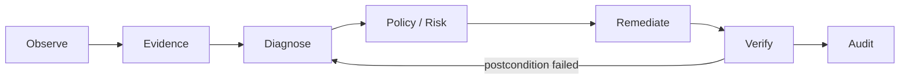

# Windows Audio Path Checker

**Evidence-driven Windows endpoint reliability engineering for audio and Bluetooth failures.**

> **Core principle:** `Command succeeded ≠ system recovered.`

Windows can report a Bluetooth headset as **Connected** while the user still has no sound. A repair command can also exit successfully while A2DP, MEDIA, AudioEndpoint, routing, or application-session state remains broken. This project treats recovery as a **verifiable state transition**, not a successful command invocation.

```text
Detect → Diagnose → Decide → Remediate → Verify → Audit
```

## Why this exists

Traditional troubleshooting scripts tend to answer **"Did the command run?"**. This project asks the harder reliability question:

**"Did the system return to a healthy, observable state?"**

It collects structured Windows evidence, classifies the failure state, ranks hypotheses, chooses the lowest-risk remediation, and independently verifies the post-action state.

### FABE positioning

| Layer | What this project demonstrates |
|---|---|
| **Function** | Diagnose Windows audio/Bluetooth paths and perform controlled recovery |
| **Advantage** | Separates action success from verified system recovery |
| **Benefit** | Reduces blind troubleshooting and makes recovery decisions explainable and auditable |
| **Evidence** | Structured evidence, explicit state machine, safety tiers, session artifacts, automated scenario tests, and an evaluation harness |

No performance percentage is claimed unless it is produced by a reproducible benchmark.

## Reliability invariant

```text
Action exit code = 0
        ≠
Device recovered
        ≠
Audio path healthy
```

A recovery is complete only when relevant postconditions are observed again.

For Bluetooth audio, the modeled path is:

```text
Physical device
  → Radio
  → Paired
  → Connected
  → A2DP
  → MEDIA
  → AudioEndpoint
  → Active
  → Default route
  → Audio engine
  → App session
  → Sound
```

## Motivating failure

A real failure pattern that motivated the architecture:

```text
Bluetooth device reports Connected
+
MEDIA / AudioEndpoint does not complete enumeration
+
user has no sound
```

Resetting Bluetooth alone cannot prove recovery. The pipeline instead:

1. **Detects** adapter, pairing, connection, A2DP/MEDIA, endpoint, service, and route evidence.
2. **Diagnoses** an explicit state such as `MEDIA_NO_ENDPOINT`.
3. **Checks invariants** such as `connected ⇒ expected downstream audio state`.
4. **Ranks causes** rather than equating correlation with causation.
5. **Decides** on the lowest-risk applicable action using R0–R5 safety tiers.
6. **Remediates** only through explicit write paths.
7. **Verifies** the resulting system state independently of command success.
8. **Audits** the incident through structured before/action/after artifacts.

## Architecture



Two runtime stacks are used:

1. **Python diagnostic pipeline** — observe → classify → plan → verify → session artifacts
2. **Elevated PowerShell recovery** — scoped cleanup → adapter/services → WinRT pairing → audio verification

The read path (`--diagnose` / `--dry-run`) does not mutate the system. Write paths require explicit invocation and Administrator privileges where Windows requires them.

LLM/ML components are intentionally outside the execution trust boundary:

```text
Model proposes → Policy validates → Executor executes → Verifier confirms
```

A model must never directly execute privileged PowerShell.

Full architecture material, including state machines, trust boundaries, sequence diagrams, component tables, failure taxonomy, and gap analysis, lives in [docs/architecture.md](docs/architecture.md).

## Safety model

| Risk | Meaning |
|---|---|
| R0 | Observation / open Settings |
| R1 | Safe refresh / re-query |
| R2 | Service restart |
| R3 | Scoped device re-enumeration / enable adapter |
| R4 | Adapter radio bounce |
| R5 | Scoped remove / re-pair / pairing-cache cleanup |

The planner should prefer the **lowest-risk action capable of addressing the diagnosed state**. For example, a wrong default output must not trigger a Bluetooth pairing reset.

Destructive or privileged operations are not treated as ordinary diagnostic reads. Dry-run/diagnostic behavior remains the safe default path.

## State machine

```text
UNKNOWN
RADIO_UNAVAILABLE
DEVICE_NOT_PAIRED
PAIRED_NOT_CONNECTED
CONNECTED_NO_A2DP
A2DP_NO_MEDIA_NODE
MEDIA_NO_ENDPOINT
ENDPOINT_DISABLED
ENDPOINT_NOT_DEFAULT
AUDIO_SERVICE_FAILURE
AUDIO_PATH_HEALTHY
```

The state machine makes failures testable: diagnosis is an assertion about observed evidence, not an opaque troubleshooting narrative.

## Evidence model

Evidence is normalized into machine-readable records. Example:

```json
{
  "device": {
    "name": "EDIFIER W800BT Pro",
    "paired": true,
    "connected": true
  },
  "bluetooth": {
    "adapter_present": true,
    "adapter_status": "OK"
  },
  "audio": {
    "media_node_present": true,
    "endpoint_present": false,
    "endpoint_active": false
  },
  "services": {
    "bthserv": "Running",
    "Audiosrv": "Running"
  }
}
```

### Evidence discipline

The project deliberately distinguishes:

```text
Observation ≠ proof
Correlation ≠ causation
Confidence ≠ certainty
Command success ≠ recovery
```

Unknown or inaccessible Windows state should remain **unknown**, rather than being silently converted into success.

## Auditable incident artifacts

A diagnostic/recovery session can produce:

```text
artifacts/sessions/<timestamp>/
  evidence-before.json
  diagnosis.json
  actions.jsonl
  evidence-after.json
  summary.json
  dataset-record.json
```

This creates a replayable chain from **evidence → decision → action → verification** and also provides structured records for future evaluation or ML experiments.

## Bluetooth pairing engine

The elevated Bluetooth path is modularized into:

```text
BluetoothDiscovery.psm1
    → multi-selector / AssociationEndpoint discovery

BluetoothCandidateRanker.psm1
    → deterministic candidate ranking

BluetoothPairingEngine.psm1
    → pairing state machine and PairAsync gating

BluetoothPairingVerifier.psm1
    → post-pair PnP / A2DP / AudioEndpoint verification
```

The engine does not call `PairAsync()` when the candidate is not pairable. It records candidate metadata and can return explicit outcomes such as `DISCOVERABLE_NOT_PAIRABLE` instead of pretending that discovery implies pairability.

WinRT auto-pair is gated by a one-shot capability probe. Unsupported projection is reported once as structured evidence rather than producing a long error loop.

## Quick start

Requirements: **Windows 10/11** and **Python 3.10+**.

```powershell
py -m venv .venv
.\.venv\Scripts\python -m pip install -e .

# Safe diagnosis
.\.venv\Scripts\python -m audio_path_checker --diagnose --device "EDIFIER W800BT Pro"

# Machine-readable result
.\.venv\Scripts\python -m audio_path_checker --diagnose --json
```

Classic GUI/session scan:

```powershell
.\run_checker.bat
# or
.\.venv\Scripts\python -m audio_path_checker
```

Elevated Bluetooth recovery:

```powershell
# Run as Administrator and place the headset in pairing mode when prompted.
.\Fix-Edifier-Bluetooth.bat
.\Fix-Edifier-Bluetooth.bat -Diagnostics -VerboseLog
.\Fix-Edifier-Bluetooth.bat -WhatIf
```

Then independently verify:

```powershell
python -m audio_path_checker --diagnose --device "EDIFIER W800BT Pro"
```

## CLI safety modes

| Flag | Behavior |
|---|---|
| `--diagnose` / `--dry-run` | Evidence + diagnosis + plan only; default safe path |
| `--repair` | Allow remediation up to R3 |
| `--aggressive-repair` | Allow remediation up to R5 |
| `--json` | Machine-readable pipeline output |
| `--device NAME` | Scope device matching |
| `--no-artifacts` | Skip writing session artifacts |

Legacy opt-in repairs remain available:

```powershell
.\.venv\Scripts\python -m audio_path_checker --unmute-browsers
.\.venv\Scripts\python -m audio_path_checker --enable-bluetooth-adapter
.\.venv\Scripts\python -m audio_path_checker --repair-bluetooth "EDIFIER W800BT Pro"
```

## Example diagnosis

```text
EDIFIER W800BT Pro — Audio Path Diagnostic

Bluetooth Adapter       PASS
Device Paired           PASS
Device Connected        PASS
A2DP Profile            WARN
MEDIA Node              FAIL
Audio Endpoint          FAIL
Windows Audio           PASS
Default Output          UNKNOWN

Diagnosis
---------
State: MEDIA_NO_ENDPOINT
Likely cause: audio_endpoint_enumeration_failure
Confidence: 82%

Recommended action
------------------
refresh_audio_endpoint_inventory
Risk: R1 LOW
```

The confidence value is a diagnostic estimate; it is not presented as certainty.

## Code map

| Area | Location |
|---|---|
| WinRT capability | `audio_path_checker/platform/winrt.py` + `scripts/Platform/WinRT.ps1` |
| Evidence | `audio_path_checker/collectors/evidence.py` + `scripts/Collectors/Evidence.ps1` |
| States | `audio_path_checker/models/states.py` |
| Classifier / invariants / root cause | `audio_path_checker/diagnostics_engine/` |
| Planner / verification | `audio_path_checker/remediation/` |
| Pipeline + CLI report | `audio_path_checker/pipeline.py` |
| Session trail | `audio_path_checker/session/artifacts.py` |
| Evaluation scaffold | `audio_path_checker/evaluation/harness.py` |
| Bluetooth pairing | `audio_path_checker/bluetooth_pairing/` + `scripts/Bluetooth/*.psm1` |
| Classic app-session scan | `audio_path_checker/diagnostics.py` |

## Verification and evaluation

Run the existing test suite with:

```powershell
python -m unittest discover -s tests -v
python -m compileall -q audio_path_checker
```

Scenario coverage includes connected-without-endpoint, wrong-default/no-Bluetooth-reset, WinRT capability failure, disabled adapter, not paired, and healthy-path behavior.

The evaluation harness defines metrics such as:

- root-cause classification accuracy
- unsafe-action rate
- recovery success rate
- false recovery / verification failure rate
- MTTD / MTTR

**The repository intentionally does not fabricate benchmark scores.** Metrics become README claims only after they are produced by a fixed, reproducible benchmark protocol.

## Flagship roadmap

The next maturity step is not "more repair commands." It is stronger evidence.

```text
Fault injection
    ↓
Versioned JSONL benchmark
    ↓
Fixed baselines
    ↓
Repeated trials
    ↓
Confidence intervals
    ↓
Ablation
    ↓
Failure / error analysis
    ↓
CI regression gate
```

### Near-term goals

- Build deterministic synthetic failure fixtures.
- Establish fixed diagnostic and remediation baselines.
- Measure RCA accuracy and unsafe-action rate.
- Measure recovery and false-recovery rates separately.
- Add confidence intervals instead of single-point claims.
- Add failure taxonomy and error analysis to evaluation reports.
- Gate regressions in CI against versioned benchmark fixtures.
- Preserve local-first operation and explicit human control for risky remediation.

### Explicit non-goals

- Claiming 100% diagnostic certainty.
- Treating successful process execution as proof of recovery.
- Giving an LLM unrestricted privileged execution.
- Hiding destructive actions behind automatic behavior.
- Publishing sensitive host evidence as benchmark data.

## Product direction

The current repository is intentionally a focused Windows audio/Bluetooth reliability system. Its architecture can later support broader endpoint reliability domains without weakening the evidence model:

```text
Endpoint telemetry
    ↓
Failure detection
    ↓
Root-cause ranking
    ↓
Policy / risk decision
    ↓
Human-approved remediation
    ↓
Independent verification
    ↓
Audit evidence
```

That evolution turns the repository from a collection of troubleshooting utilities into an **evidence-driven endpoint reliability decision platform**.

## License

MIT
