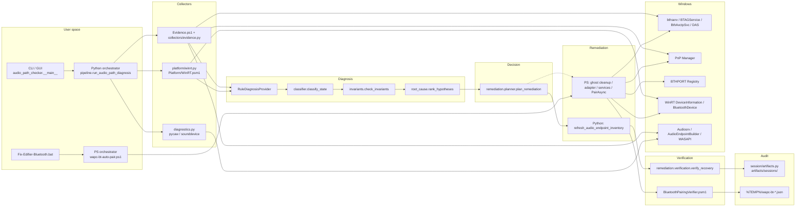
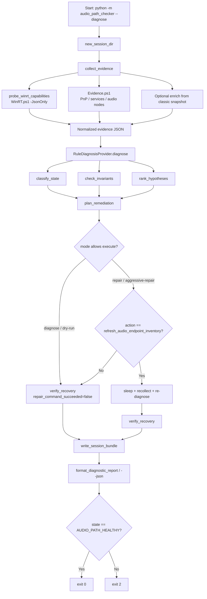
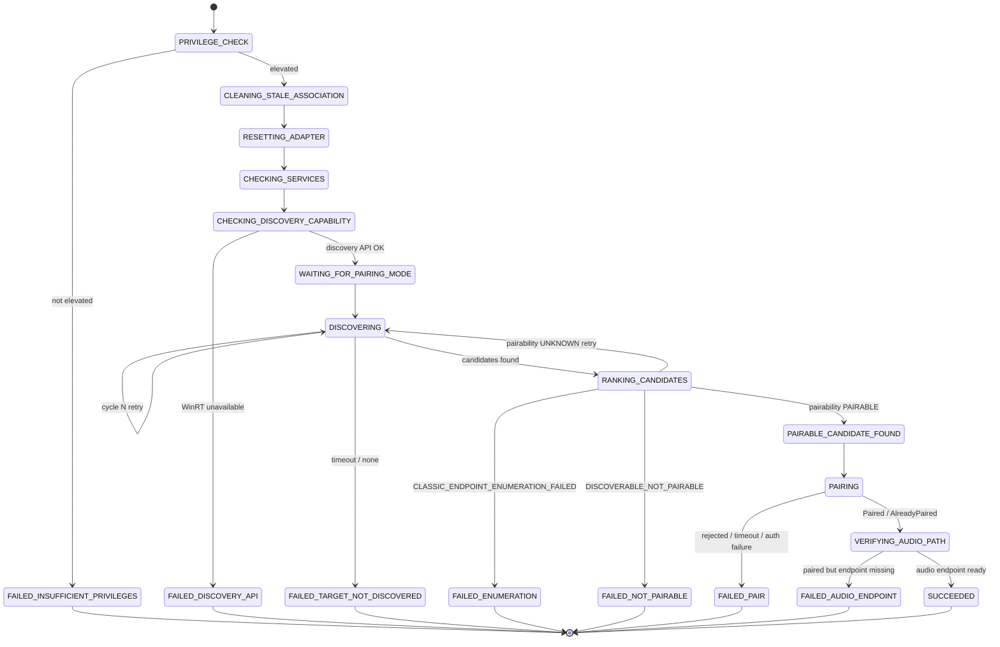
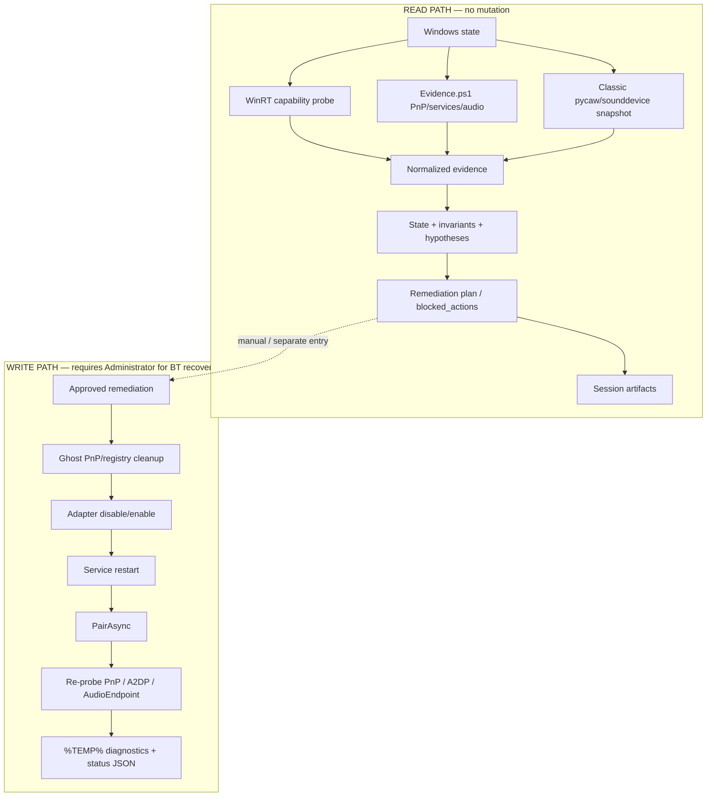
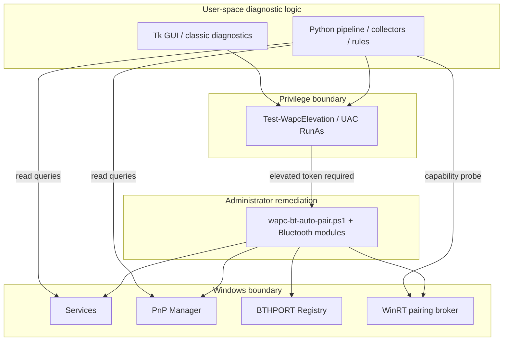
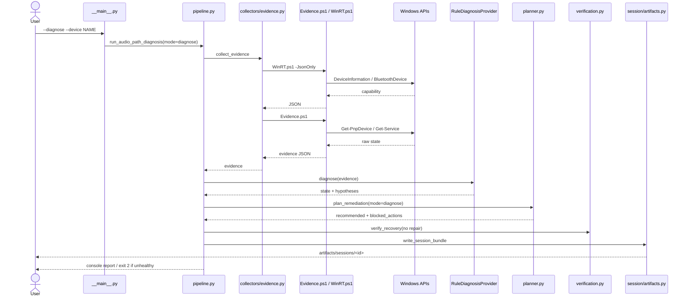
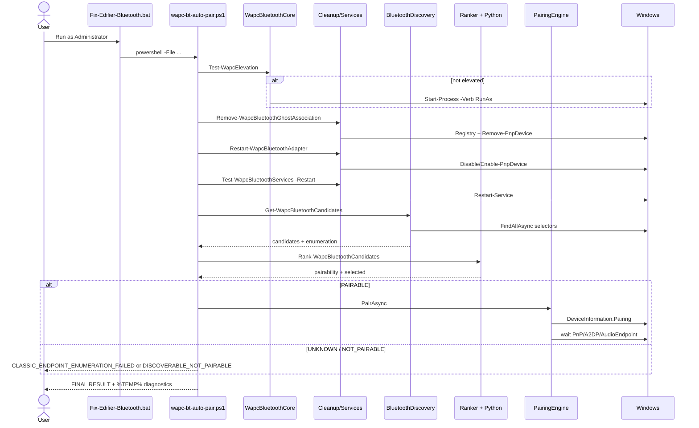

# Architecture — Windows Audio Path Checker

This document describes the **current** architecture of
`windows-audio-path-checker` (v0.5.x) as implemented in source. It does not
describe planned or aspirational components.

Two runtime stacks coexist:

1. **Python diagnostic pipeline** — observe → classify → plan → (limited) act → verify → session artifacts  
2. **Elevated PowerShell Bluetooth recovery** — privilege → cleanup → adapter/services → WinRT pair → audio verification  

Classic GUI/session scanning (`diagnostics.py`, `gui.py`, `bluetooth.py`) remains for per-app mute/routing checks and is a separate path from `run_audio_path_diagnosis`.

---

## 1. System Overview

Windows Audio Path Checker is an evidence-driven diagnostic and recovery toolkit for Windows playback failures — especially Bluetooth headsets that appear **Connected** while the A2DP → MEDIA → AudioEndpoint path never becomes ready.

On the read path, Python collects a normalized evidence document (adapter, device pair/connect, PnP nodes, audio endpoints, services, WinRT capability), classifies an explicit `AudioPathState`, checks invariants, ranks root-cause hypotheses, and emits a remediation plan gated by risk level (R0–R5). Session artifacts under `artifacts/sessions/<timestamp>/` record evidence before/after, diagnosis, and a dataset record.

On the write path, elevated PowerShell (`scripts/wapc-bt-auto-pair.ps1`, launched by `Fix-Edifier-Bluetooth.bat`) performs scoped ghost-pair cleanup, adapter bounce, Bluetooth service recovery, WinRT candidate discovery/ranking, `PairAsync` only when pairable, and post-pair audio-endpoint verification. Administrator privilege is required for registry/PnP/service mutation; non-elevated runs fail fast or self-elevate via UAC.

The core design rule is: **Bluetooth Connected ≠ Audio Working**. Command exit codes and “Connected” UI state are never treated as recovery success without verification evidence.

Conceptual flow:

```text
Windows Endpoint
      ↓
Signal Collection (PnP / BT / Audio / Services / WinRT)
      ↓
Normalization (evidence JSON + feature vector)
      ↓
Diagnostic Rules (state + invariants)
      ↓
Hypothesis Ranking
      ↓
Remediation Policy (risk R0–R5)
      ↓
Optional Act (Python: refresh only today; PS: full BT recovery)
      ↓
Verification
      ↓
Audit / Session Artifacts
```

---

## 2. High-Level Architecture Diagram



External Windows dependencies that appear in code:

| Dependency | Used by |
|---|---|
| WinRT `DeviceInformation` / `BluetoothDevice` / `PairAsync` | `scripts/Platform/WinRT.psm1`, `BluetoothDiscovery.psm1`, `BluetoothPairingEngine.psm1` |
| PnP (`Get-PnpDevice`, Enable/Disable/Remove) | `Evidence.ps1`, cleanup/adapter modules |
| BTHPORT registry (`Devices`, `Keys`) | `WapcBluetoothCleanup.psm1`, legacy `bluetooth.py` |
| Services: `bthserv`, `BTAGService`, `BthAvctpSvc`, `DeviceAssociationService` | `Evidence.ps1`, `WapcBluetoothServices.psm1` |
| Services: `Audiosrv`, `AudioEndpointBuilder` | evidence + classic diagnostics |
| pycaw / WASAPI / sounddevice | `diagnostics.py`, GUI |

---

## 3. Diagnostic Pipeline Diagram

Python `--diagnose` / `--dry-run` path (`pipeline.run_audio_path_diagnosis`):



Notes from implementation:

- Policy still **recommends** R1–R5 actions in diagnose mode; only R0 is marked executable for diagnose/dry-run.
- Python execute path today only wires `refresh_audio_endpoint_inventory`. R2–R5 actions are planned/blocked, not executed by `pipeline.py`.
- Elevated Bluetooth recovery is a separate entry (`Fix-Edifier-Bluetooth.bat`), not invoked automatically by `--diagnose`.

---

## 4. Bluetooth Recovery State Machine

States used by `scripts/Bluetooth/BluetoothPairingEngine.psm1` and stage results in `WapcBluetoothCore.psm1`:



Authoritative stage keys (`New-WapcStageResults`):

| Stage | Meaning |
|---|---|
| `PrivilegeCheck` | Elevated token |
| `GhostCleanup` | Scoped BTHPORT + PnP removal |
| `AdapterReset` | Disable/enable Bluetooth adapter |
| `ServicesHealthy` | BT service command vs final state |
| `DiscoveryApi` | WinRT DeviceInformation usable |
| `TargetDiscovered` | Name-matched candidates seen |
| `ClassicEnumeration` | Classic/AEP FindAllAsync outcomes |
| `Pairability` | `PAIRABLE` / `NOT_PAIRABLE` / `UNKNOWN` |
| `PairableEndpoint` | Selected pairable candidate |
| `PairRequest` / `PairingSucceeded` | `PairAsync` attempt/result |
| `AudioEndpoint` | Post-pair PnP/A2DP/endpoint wait |

Important classification rule: enumeration **ERROR** must not become `DISCOVERABLE_NOT_PAIRABLE`. Use `PAIRABILITY_UNDETERMINED` / `CLASSIC_ENDPOINT_ENUMERATION_FAILED` instead (`bluetooth_pairing.failures.classify_outcome`).

---

## 5. Read Path vs Write Path



| Operation | Path | Privilege |
|---|---|---|
| `--diagnose` / `--dry-run` | Read | User |
| WinRT capability probe | Read | User |
| Evidence collection | Read | User |
| GUI unmute browsers | Write (session volume) | User |
| `--enable-bluetooth-adapter` / legacy `--repair-bluetooth` | Write | Admin (elevated PS) |
| `Fix-Edifier-Bluetooth.bat` / `wapc-bt-auto-pair.ps1` | Write | **Admin required** |
| Registry BTHPORT clear / PnP remove / service restart | Write | Admin |
| `-WhatIf` on cleanup/adapter | Simulated write | Admin preferred |

---

## 6. Component Responsibility Table

| Component | Responsibility | Inputs | Outputs | Side Effects | Privilege | Source |
|---|---|---|---|---|---|---|
| CLI | Mode routing | argv | report / exit code | None (diagnose) | User | `audio_path_checker/__main__.py` |
| Pipeline | Orchestrate diagnose→plan→verify→artifacts | device name, mode | report dict | Session files | User | `audio_path_checker/pipeline.py` |
| Evidence collector | Gather endpoint state | device filter | evidence JSON | None | User | `collectors/evidence.py`, `scripts/Collectors/Evidence.ps1` |
| WinRT probe | One-shot discovery capability | — | capability JSON | None | User | `platform/winrt.py`, `scripts/Platform/WinRT.ps1` |
| Classifier | Map evidence → `AudioPathState` | evidence | state + confidence | None | — | `diagnostics_engine/classifier.py` |
| Invariants | Soft/hard consistency checks | evidence, state | findings | None | — | `diagnostics_engine/invariants.py` |
| Root-cause ranker | Hypothesis list | evidence, classification | ranked causes | None | — | `diagnostics_engine/root_cause.py` |
| Diagnosis provider | Provider abstraction | evidence | diagnosis dict | None | — | `providers/diagnosis.py` |
| Planner | Risk-gated action list | diagnosis, mode | plan / blocked | None | — | `remediation/planner.py` |
| Verifier | System recovered? | before/after evidence | verification | None | — | `remediation/verification.py` |
| Session artifacts | Persist run | diagnosis/evidence | JSON/JSONL | Disk write | User | `session/artifacts.py` |
| PS Core | Elevation, stages, reports | target name/address | context | Log files | Detects Admin | `scripts/Bluetooth/WapcBluetoothCore.psm1` |
| PS Cleanup | Ghost pair removal, adapter reset | context | stage status | Registry/PnP | Admin | `scripts/Bluetooth/WapcBluetoothCleanup.psm1` |
| PS Services | Restart + final-state check | service names | health report | Service control | Admin | `scripts/Bluetooth/WapcBluetoothServices.psm1` |
| PS Discovery | Multi-selector WinRT enum | name patterns | candidates + enumeration | None | User/Admin | `scripts/Bluetooth/BluetoothDiscovery.psm1` |
| PS Ranker | Call Python ranker / fallback | candidates JSON | ranked + pairability | None | User | `scripts/Bluetooth/BluetoothCandidateRanker.psm1` |
| Python ranker | Deterministic scoring | stdin JSON | ranked JSON | None | — | `bluetooth_pairing/candidates.py` |
| PS Pair engine | State machine + PairAsync | context | pair outcome | Pairing | Admin recommended | `scripts/Bluetooth/BluetoothPairingEngine.psm1` |
| PS Verifier | Wait for audio endpoints | name patterns | verification | None | User | `scripts/Bluetooth/BluetoothPairingVerifier.psm1` |
| Classic diagnostics | App-session mute/volume | WASAPI sessions | findings | Optional unmute | User | `diagnostics.py` |
| GUI | Interactive classic scan | — | UI | Optional unmute | User | `gui.py` |

---

## 7. Evidence Model

```text
Raw Windows signals
  (PnP nodes, services, WinRT capability, optional pycaw snapshot)
        ↓
Normalized evidence JSON
  device / bluetooth / pnp / audio / services / environment / capabilities
        ↓
Feature vector (evidence_feature_vector)
        ↓
AudioPathState + invariants
        ↓
Ranked hypotheses (cause, confidence)
        ↓
Remediation plan (recommended + blocked_actions)
        ↓
Optional action + verification evidence
        ↓
Session bundle + dataset-record.json
```

Evidence top-level keys (from `collect_evidence` / `Evidence.ps1`):

- `device` — pair/connect/address/instance  
- `bluetooth` — adapter presence/status/driver  
- `pnp` — nodes, a2dp/media/endpoint lists  
- `audio` — media/a2dp/endpoint flags (+ optional default playback)  
- `services` — BT + audio service statuses  
- `capabilities` — WinRT discovery probe  
- `collection_errors` — non-fatal collector failures  

Session outputs (`session/artifacts.write_session_bundle`):

```text
artifacts/sessions/<timestamp>/
  evidence-before.json
  diagnosis.json
  evidence-after.json
  summary.json
  dataset-record.json
  actions.jsonl          # when actions ran
```

Bluetooth recovery outputs (`%TEMP%`):

- `wapc-bt-auto-pair.log`
- `wapc-bt-auto-pair-status.json` (stage map)
- `wapc-bt-pair-diagnostics.json`
- `wapc-bt-candidates.json`
- `wapc-bt-enumeration.json`

---

## 8. Failure Taxonomy

Derived from `bluetooth_pairing.failures.FailureReason`, root-cause causes, and PS stage classifications:

```text
Bluetooth
├── Adapter (ADAPTER_FAILURE / ADAPTER_RESET_FAILED / RADIO_UNAVAILABLE)
├── Discovery (DISCOVERY_API_UNAVAILABLE / DISCOVERY_ENUMERATION_FAILED)
├── Classic enum (CLASSIC_ENDPOINT_ENUMERATION_FAILED)
├── Pairability (PAIRABILITY_UNDETERMINED / DISCOVERABLE_NOT_PAIRABLE)
├── Pairing (PAIR_REQUEST_FAILED / PAIRING_REJECTED / PAIRING_TIMEOUT /
│            PAIR_AUTHENTICATION_FAILED / PAIRING_ALREADY_IN_PROGRESS)
└── Profile / audio lag (A2DP_ENDPOINT_TIMEOUT /
                        PAIRING_SUCCEEDED_AUDIO_ENDPOINT_MISSING)

Windows
├── Permissions (INSUFFICIENT_PRIVILEGES / AccessDenied on PnP/registry)
├── Service (SERVICE_CONTROL_FAILED / SERVICE_FAILURE)
├── Registry (GHOST_CLEANUP_FAILED)
├── PnP (PNP_ENUMERATION_TIMEOUT / removal failures)
└── Driver (bluetooth_driver_state_corruption hypothesis)

Audio path states
├── DEVICE_NOT_PAIRED
├── PAIRED_NOT_CONNECTED
├── CONNECTED_NO_A2DP
├── A2DP_NO_MEDIA_NODE
├── MEDIA_NO_ENDPOINT
├── ENDPOINT_DISABLED / ENDPOINT_NOT_DEFAULT
└── AUDIO_SERVICE_FAILURE

Tooling
├── RANKER_INPUT_INVALID / NO_CANDIDATES
├── invalid_probe_json / empty_probe_output (WinRT probe parsing)
└── UNKNOWN_FAILURE
```

---

## 9. Trust Boundaries



Where `AccessDenied` typically appears:

- Opening `HKLM\...\BTHPORT\Parameters\Devices` without Admin  
- `Remove-PnpDevice` / `pnputil /remove-device` without Admin  
- `Restart-Service` / `Start-Service` on protected Bluetooth services without Admin  
- Adapter Disable/Enable without Admin  

The recovery orchestrator treats these as `INSUFFICIENT_PRIVILEGES` or stage `FAIL`/`BLOCKED`, not as headset pairing refusal.

---

## 10. Runtime Sequence Diagram

### Diagnose (read path)



### Bluetooth recovery (write path)



---

## Current Architectural Gaps

| Capability | Status | Notes |
|---|---|---|
| Explicit domain model | **Implemented** | `AudioPathState`, `PairState`, `FailureReason` |
| Normalized evidence schema | **Implemented** | Evidence JSON + feature vector |
| Deterministic rule engine | **Implemented** | classifier + invariants + `RuleDiagnosisProvider` |
| Hypothesis ranking | **Implemented** | `rank_hypotheses` |
| Confidence scoring | **Implemented** | classification + hypothesis confidence |
| Remediation policy layer | **Implemented** | R0–R5, mode caps, `blocked_actions` |
| Dry-run support | **Partial** | `--dry-run` / diagnose; PS `-WhatIf`; most R2–R5 not executed in Python |
| Privilege isolation | **Partial** | Admin gate + UAC; no separate privileged daemon |
| Idempotent remediation | **Partial** | Scoped cleanup re-runnable; no formal idempotency contracts |
| Rollback | **Partial** | `finally` restores adapter/services; no undo for deleted BTHPORT keys |
| Post-action verification | **Implemented** | `verify_recovery`, `Test-BluetoothPairVerification` |
| Structured audit trail | **Implemented** | Session JSON/JSONL + `%TEMP%` BT diagnostics |
| Correlation / run IDs | **Partial** | Session timestamp / UUID `case_id`; no distributed trace IDs |
| OpenTelemetry tracing | **Missing** | Not present |
| Metrics | **Partial** | `evaluation/harness.py` metric names only; values unused |
| Reproducible diagnostic bundles | **Implemented** | `artifacts/sessions/` |
| Dependency inversion for Windows APIs | **Partial** | `DiagnosisProvider` ABC; WinRT/PnP via subprocess scripts, not ports |
| Mockable adapters for tests | **Partial** | Evidence injection + subprocess mocks; no formal PnP/service adapters |
| Python↔PS auto-pair integration | **Partial** | Separate entry points; diagnose does not invoke elevated pairer |
| ML/LLM diagnosis providers | **Partial** | Stubs only (`MLDiagnosisProvider`, `LLMDiagnosisProvider`) |

---

## Source map (quick)

| Concern | Path |
|---|---|
| CLI | `audio_path_checker/__main__.py` |
| Diagnose pipeline | `audio_path_checker/pipeline.py` |
| Evidence | `audio_path_checker/collectors/evidence.py`, `scripts/Collectors/Evidence.ps1` |
| States | `audio_path_checker/models/states.py` |
| Rules / RCA | `audio_path_checker/diagnostics_engine/` |
| Plan / verify | `audio_path_checker/remediation/` |
| Artifacts | `audio_path_checker/session/artifacts.py` |
| Pair ranking / failures | `audio_path_checker/bluetooth_pairing/` |
| Elevated recovery | `scripts/wapc-bt-auto-pair.ps1`, `scripts/Bluetooth/*.psm1` |
| Thin EDIFIER wrapper | `Fix-Edifier-Bluetooth.bat` |
| CI | `.github/workflows/tests.yml` |
