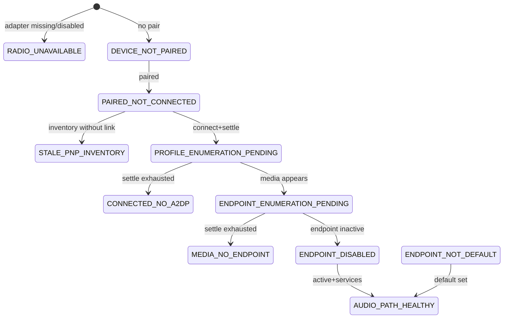

# Bluetooth audio state machine

## Design principle

```text
Observe → Correlate identity → Build evidence → Classify uncertainty
  → Select minimum-risk action → Act → Measure delta → Verify postcondition
  → Escalate only with evidence → Persist audit trail
```

**Bluetooth Connected ≠ Audio Working.**

## System boundary

Python diagnostic pipeline classifies and plans. Only R1
`refresh_audio_endpoint_inventory` executes inside `pipeline.py` (non-elevated,
read-only PnP re-query + bounded settle). R2–R5 are planned/blocked or handled
by elevated PowerShell / Bluetooth CLI helpers.

## Evidence sources (semantics)

| Source | Semantics |
| --- | --- |
| BTHENUM / paired device node | Authoritative for pairing presence |
| Collector `connected` | Eventually consistent link signal |
| Address-scoped A2DP / MEDIA / AudioEndpoint | Authoritative for path inventory |
| FriendlyName | Weak supporting only |
| SCM Audiosrv | Authoritative for Windows Audio |
| WinRT capability probe | Authoritative for discovery APIs |

## Identity model

Canonical MAC: 12 lowercase hex. Formats `CC:14:…`, `CC-14-…`, `cc14…` normalize
equally. Ghost nodes (different MAC) never credit the target (Invariant B/E).

## State machine (core)



Temporal PENDING states are only assigned while `settling=True` (R1 loop).

## Check statuses

`PASS | FAIL | PENDING | UNKNOWN | STALE | NOT_APPLICABLE`

When disconnected, missing A2DP/MEDIA/endpoint is `NOT_APPLICABLE`, not FAIL.

## Recovery ladder

| Risk | Action | Mutation |
| --- | --- | --- |
| R0 | connect_headset_and_recheck / observe | none |
| R1 | refresh_audio_endpoint_inventory | none (Get-PnpDevice only) |
| R2 | restart BT audio services | elevated |
| R3 | scoped re-enumerate | elevated |
| R4 | adapter bounce | elevated |
| R5 | clear pairing + re-pair | elevated |

Escalate only when prior stage shows no progress / failed postcondition.

## Invariants

- **A** Healthy requires verified path signals
- **B** Ghost MEDIA for MAC B never helps MAC A
- **C** R1 never pairs/registry/adapter/remove
- **D** Success = postcondition, not exit code
- **E** Identity survives formatting / ghosts / name collisions
- **F** Deterministic classifier
- **G** Unknown stays UNKNOWN in check statuses

## Replay

```text
python -m audio_path_checker --replay artifacts/sessions/2026-08-27T170534
```

Classifies captured `evidence-before.json` without live hardware.
